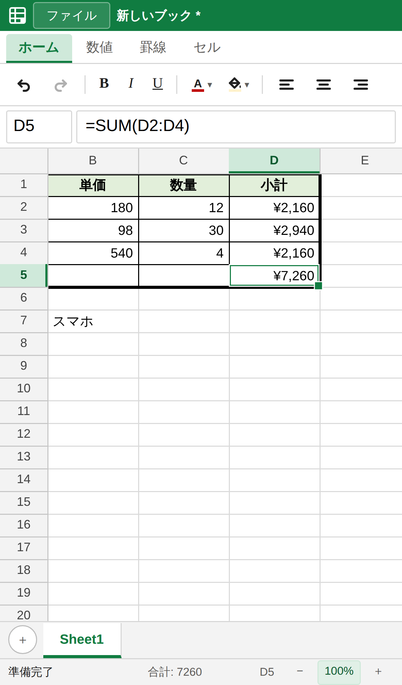

# Excella

Excel のような表計算アプリです。**Windows / macOS / Linux のデスクトップ版**（Electron）と、
**スマホやタブレットのブラウザから使える PWA 版**があり、どちらも同じコードで動きます。
React + TypeScript で作られていて、数式エンジンに [HyperFormula](https://hyperformula.handsontable.com/)、
xlsx の読み書きに [ExcelJS](https://github.com/exceljs/exceljs) を使っています。




## スマホ・タブレットで使う（PWA）

`main` に push すると GitHub Pages に公開されます（`.github/workflows/pages.yml`）。
公開先は **https://isamutakiguchi.github.io/excella/** です。
初回だけリポジトリの Settings → Pages → Source を「GitHub Actions」にしてください。

ホーム画面に追加するとアプリのように全画面で起動し、オフラインでも開けます。

- **iPhone / iPad**（Safari）: 共有ボタン →「ホーム画面に追加」
- **Android**（Chrome）: メニュー（︙）→「アプリをインストール」または「ホーム画面に追加」
- **PC のブラウザ**（Chrome / Edge）: アドレスバー右端のインストールアイコン

画面の広さに合わせて作りが変わります。**幅 1280px 未満、または縦が短いとき**（横向きのスマホなど）は、
リボンが「ホーム／数値／罫線／セル」のタブ式になり、横スクロールで機能を探さずに済みます。
広い画面では従来どおり全グループを 1 段に並べます。

**タッチ端末では表示倍率が 130% から始まります**（指で押せる大きさにするため）。
倍率はステータスバー右端の `−` `＋` で変えられ、数字を押すと 100% に戻ります。
セルの行高・列幅そのものは変わらないので、ファイルの中身には影響しません。

### スマホでの操作

| 操作           | 方法                                                   |
| -------------- | ------------------------------------------------------ |
| セルを選ぶ     | タップ                                                 |
| 編集する       | 選んだセルをもう一度タップ（または数式バーをタップ）   |
| 数式の参照     | `=` を打ってから、参照したいセルをタップ               |
| 文字色・塗り   | ツールバーの色ボタンを押すとパレットが開く             |
| 表示を拡大縮小 | ステータスバー右端の `−` `＋`                          |
| 確定・取消     | キーボードの Enter ／ 別のセルをタップ                 |
| スクロール     | 指でドラッグ                                           |
| メニュー       | 長押し（切り取り・貼り付け・行列の挿入削除・結合など） |
| 行・列ごと選ぶ | 行番号・列名をタップ                                   |
| 範囲を選ぶ     | 名前ボックスに `A1:C5` のように入力                    |
| ファイルを開く | 左上の「ファイル」→「開く…」                           |
| 保存           | 「ファイル」→「保存」                                  |

ブラウザ版のファイル保存は、Chrome / Edge / Android Chrome では**開いたファイルへの上書き**が
できます（File System Access API）。iPhone の Safari など対応していないブラウザでは
**ダウンロード**として保存されるので、「ファイル」アプリから開き直してください。

ドラッグでの範囲選択、フィルハンドル、列幅の変更はマウス操作です（タッチではスクロールになります）。

<br clear="right" />

## できること

- **複数シート** — タブで追加・切り替え・名前変更（ダブルクリック）・削除
- **セル編集と数式** — `=SUM(A1:A10)` のような数式。SUM / IF / VLOOKUP など HyperFormula の
  数百の関数がそのまま使えます。循環参照の検出や、行列の挿入削除に伴う参照の自動追従つき
- **数式の参照をセルで選ぶ** — `=` から入力を始めると、カーソルキーやマウス（スマホはタップ）で
  セルを選んでそのまま数式に入れられます。Shift + カーソルやドラッグで `A1:B3` のような範囲に。
  編集中の数式が参照しているセルは色分けして囲まれます
- **書式** — 太字・斜体・下線、文字色、背景色、左中右の配置、表示形式（桁区切り・パーセント・
  通貨・日付など）
- **表示形式** — `#,##0` / `0.00%` / `¥#,##0` / `yyyy/mm/dd` などのサブセットに対応
- **行・列の操作** — 挿入・削除、列幅と行高のドラッグ変更。境界のダブルクリックで
  内容に合わせて自動調整
- **罫線** — 格子・外枠・内側・各辺のプリセット。細線／中線／太線と色を選べます。
  xlsx との往復にも対応
- **結合セル** — 選択範囲を 1 つのセルに結合／解除。xlsx との往復にも対応
- **ウィンドウ枠の固定** — アクティブセルの左上で固定。見出し行・見出し列を残したままスクロールできる
- **フィルハンドル** — 選択範囲の右下をドラッグして値・数式・書式を伸ばす。
  等差の数値は連番、`第 1 週` のように数字を含む文字列は数字を増やす
- **右クリックメニュー** — 切り取り・コピー・貼り付け、行列の挿入削除、結合、固定、
  内容と書式のクリア
- **コピー＆ペースト** — 値・数式・書式ごとコピー。貼り付け時に相対参照を自動補正します。
  Excel や Google スプレッドシートとの間は TSV テキストでやり取りできます
- **元に戻す / やり直し** — 行削除のように数式が書き換わる操作も含めて 50 段階
- **並べ替え** — 選択範囲をアクティブセルの列で昇順・降順に。先頭行を見出しとして除外できる
- **ファイル入出力** — `.xlsx` の読み書き、`.csv` / `.tsv` の読み込みと CSV 書き出し
- **ステータスバー** — 入力状態（入力／編集／参照）、選択範囲の合計・平均・データの個数、表示倍率
- **レスポンシブ** — 画面の広さでリボンの作りが変わり、スマホでは倍率を上げて指で押せる大きさにします
- **日本語入力** — セルを選んでそのままかな入力を始められます。変換確定の Enter で
  セルまで確定してしまうことはありません

### 対応していないもの

マクロ (VBA)、グラフ、ピボットテーブル、条件付き書式、オートフィルタ、データ検証、
画像・図形、コメント。xlsx を読み込んだときこれらの情報は保持されず、保存すると失われます。
罫線は実線の 3 段階（細線・中線・太線）のみで、点線や二重線は読み込み時に
いちばん近い実線へ寄せます。

## キーボード操作

| 操作                       | キー                                             |
| -------------------------- | ------------------------------------------------ |
| セル移動                   | 矢印キー / Tab / Enter                           |
| 範囲選択                   | Shift + 矢印キー、Shift + クリック、ドラッグ     |
| データの端まで移動         | Ctrl (⌘) + 矢印キー                              |
| すべて選択                 | Ctrl (⌘) + A                                     |
| 編集開始                   | F2 / ダブルクリック / そのまま文字入力（上書き） |
| 数式に参照を入れる         | `=` の後にカーソルキー / クリック                |
| 参照を範囲に広げる         | Shift + カーソルキー / ドラッグ                  |
| 編集の取消                 | Esc                                              |
| 内容のクリア               | Delete / Backspace                               |
| 太字・斜体・下線           | Ctrl (⌘) + B / I / U                             |
| コピー・切り取り・貼り付け | Ctrl (⌘) + C / X / V                             |
| 元に戻す・やり直し         | Ctrl (⌘) + Z / Shift + Z                         |
| 開く・保存                 | Ctrl (⌘) + O / S                                 |

## 開発

```bash
npm install
npm run dev          # 開発用に起動（ホットリロードあり）
npm run lint         # ESLint（規約）
npm run format       # Prettier（整形）。確認だけなら format:check
npm run typecheck    # main / renderer / test の 3 つの tsconfig を型チェック
npm test             # vitest（純粋モジュールと xlsx・CSV の往復テスト）
npm run build        # out/ に本番ビルド
npm start            # ビルド済みのものを起動

npm run dev:web      # ブラウザ版を開発用に起動（http://localhost:5173）
npm run build:web    # ブラウザ／PWA 版を out/web にビルド
npm run preview:web  # ビルドしたブラウザ版を配信して確認
```

ブラウザ版は `out/web` の静的ファイルだけで動くので、GitHub Pages 以外の
どのホスティングにも置けます。サブパスに置くときは `WEB_BASE=/excella/ npm run build:web`
のようにパスを渡してください（Service Worker と manifest のスコープに使います）。

### 動作確認（スモークテスト）

サンプルデータを流し込んで実際に描画されるか確かめます。`--screenshot` を付けると PNG を保存します。

```bash
npm run smoke                                   # デスクトップ環境で
npm run smoke:headless                          # Linux の CI など（xvfb を使用）
electron ./out/main/index.js --smoke --screenshot shot.png

# ファイルを指定すると、関連付けから開いたときと同じ経路で読み込んで確認できる
electron ./out/main/index.js --smoke data.xlsx

# ブラウザ版：iPhone 相当のタッチ端末をエミュレートして、タップで編集できるところまで確認
npm run smoke:web
node scripts/web-smoke.mjs --screenshot mobile.png   # ビルド済みなら直接
```

ブラウザ版のスモークは Playwright の Chromium を使います。手元に無ければ
`npx playwright-core install chromium` で入ります（`CHROMIUM_PATH` で既存の Chromium も指定可）。

### 配布パッケージの作成

```bash
npm run dist         # electron-builder で現在の OS 向けにパッケージング
```

**3 つの OS 向けをまとめて作るなら GitHub Actions が使えます。**
`v1.2.3` のようなタグを push すると、macOS / Windows / Linux それぞれの
ランナーでビルドして Release（下書き）に添付します。手元に Mac が無くても
macOS 版が作れます。Actions タブの「Run workflow」からビルドだけ試すこともできます。

```bash
git tag v0.1.0 && git push origin v0.1.0
```

**Windows は `Excella-Setup-x.y.z.exe` の 1 ファイル**です。ダブルクリックするだけで
ユーザー領域にインストールされ（管理者権限は不要）、デスクトップとスタートメニューに
ショートカットができて自動で起動します。アンインストールは「アプリと機能」から。

Windows のインストーラは **タグを打たなくても** CI が push のたびに作っています。
Actions タブ → 該当の実行 → 下部の「Artifacts」→ `Excella-Windows-Installer` から
zip をダウンロードすると中に exe が入っています（ダウンロードには GitHub へのログインが必要。
不特定多数に配るなら Release を使ってください）。CI では作った exe を Windows 上で
実際に起動し、描画と日本語入力の検査まで通しています。

配布物には**コード署名をしていません**。初回起動時に警告が出るので、
Windows は SmartScreen の「詳細情報」→「実行」、macOS は右クリック →「開く」で回避できます。
署名するには Apple Developer ID（年額）や Windows のコード署名証明書が必要です。

アイコンは `build/icon.png`（と Windows 用の `build/icon.ico`）に入っています。
差し替えたいときはこの 2 つを置き換え、`python3 scripts/make-pwa-icons.py` で
ホーム画面用（`src/renderer/public/icons/`）も作り直してください。

## 構成

```
src/
├─ main/       Electron main。ウィンドウ、メニュー、ダイアログ、ファイル読み書き
│   └─ io/     ExcelJS による xlsx の変換（main プロセスでのみ動く）
├─ preload/    contextBridge で renderer に公開する最小限の API
├─ shared/     main と renderer で共有する純粋モジュール（モデル・A1 変換・CSV・表示形式・xlsx 変換）
└─ renderer/   React の UI（デスクトップ版とブラウザ版で共通）
    ├─ bridge.ts     ファイル入出力の入口。Electron なら preload、ブラウザなら webBridge.ts
    ├─ engine/ HyperFormula のラッパ
    ├─ store/  zustand による状態管理と undo/redo
    ├─ grid/   Canvas によるグリッド描画と操作
    └─ ui/     ツールバー・数式バー・シートタブ・ステータスバー
```

設計上の要点：

- **セキュリティ** — `contextIsolation: true` / `nodeIntegration: false` / `sandbox: true`。
  ファイル I/O は main プロセスだけが行い、renderer にはプレーンな JSON しか渡しません。
  preload が公開するのは「ダイアログを開いて読み書きする」4 つの操作だけで、
  任意パスへの読み書き API はありません。
- **1 つの renderer を 2 つの器で動かす** — Electron では preload の橋、ブラウザでは
  File System Access API／ファイル選択／ダウンロードで同じ `ExcellaApi` を実装しています。
  xlsx の変換は `shared/xlsx.ts` に置き、バイト列だけを扱うので両方で動きます。
- **タッチ端末** — セル入力欄は PC では常にフォーカスを持ちますが（IME のため）、
  タッチ端末ではソフトキーボードが出てしまうので編集中だけフォーカスします。
- **役割分担** — 値と数式の計算は HyperFormula が持ち、書式・列幅行高・シート構成は
  アプリ側のモデルが持ちます。
- **undo/redo** — HyperFormula 側の undo スタックは使わず、アプリ側で変更前のモデル
  スナップショットを積む単一スタックに統一しています。書式と構造変更が混ざっても
  順序がずれないためです。
- **グリッド描画** — 可視範囲だけを Canvas に描くので、行数を増やしてもスクロールは一定コストです。
  ウィンドウ枠を固定している場合は最大 4 つのペインに分けて描画します。

## ライセンス

GPLv3 です（`LICENSE` を参照）。数式エンジンの HyperFormula が GPL-3.0-only の無償枠
（`licenseKey: 'gpl-v3'`）で組み込まれているため、本体も GPLv3 で配布します。
クローズドな商用配布を行う場合は HyperFormula の商用ライセンスが別途必要です。
