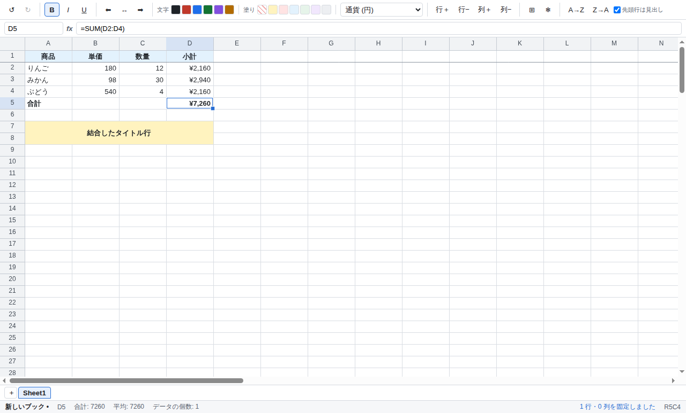

# Excella

Excel のような表計算のデスクトップアプリです。Electron + React + TypeScript で作られていて、
数式エンジンに [HyperFormula](https://hyperformula.handsontable.com/)、xlsx の読み書きに
[ExcelJS](https://github.com/exceljs/exceljs) を使っています。



## できること

- **複数シート** — タブで追加・切り替え・名前変更（ダブルクリック）・削除
- **セル編集と数式** — `=SUM(A1:A10)` のような数式。SUM / IF / VLOOKUP など HyperFormula の
  数百の関数がそのまま使えます。循環参照の検出や、行列の挿入削除に伴う参照の自動追従つき
- **書式** — 太字・斜体・下線、文字色、背景色、左中右の配置、表示形式（桁区切り・パーセント・
  通貨・日付など）
- **表示形式** — `#,##0` / `0.00%` / `¥#,##0` / `yyyy/mm/dd` などのサブセットに対応
- **行・列の操作** — 挿入・削除、列幅と行高のドラッグ変更。境界のダブルクリックで
  内容に合わせて自動調整
- **結合セル** — 選択範囲を 1 つのセルに結合／解除。xlsx との往復にも対応
- **ウィンドウ枠の固定** — アクティブセルの左上で固定。見出し行・見出し列を残したままスクロールできる
- **フィルハンドル** — 選択範囲の右下をドラッグして値・数式・書式を伸ばす。
  等差の数値は連番、`第 1 週` のように数字を含む文字列は数字を増やす
- **右クリックメニュー** — 切り取り・コピー・貼り付け、行列の挿入削除、結合、固定、
  内容と書式のクリア
- **コピー＆ペースト** — 値・数式・書式ごとコピー。貼り付け時に相対参照を自動補正します。
  Excel や Google スプレッドシートとの間は TSV テキストでやり取りできます
- **元に戻す / やり直し** — 行削除のように数式が書き換わる操作も含めて 50 段階
- **並べ替え** — 選択範囲をアクティブセルの列で昇順・降順に。先頭行を見出しとして除外できる
- **ファイル入出力** — `.xlsx` の読み書き、`.csv` / `.tsv` の読み込みと CSV 書き出し
- **ステータスバー** — 選択範囲の合計・平均・データの個数
- **日本語入力** — セルを選んでそのままかな入力を始められます。変換確定の Enter で
  セルまで確定してしまうことはありません

### 対応していないもの

マクロ (VBA)、グラフ、ピボットテーブル、条件付き書式、オートフィルタ、データ検証、
画像・図形、コメント。xlsx を読み込んだときこれらの情報は保持されず、保存すると失われます。
セルの罫線も未対応です（結合セルとウィンドウ枠の固定は往復・表示とも対応しています）。

## キーボード操作

| 操作                       | キー                                             |
| -------------------------- | ------------------------------------------------ |
| セル移動                   | 矢印キー / Tab / Enter                           |
| 範囲選択                   | Shift + 矢印キー、Shift + クリック、ドラッグ     |
| データの端まで移動         | Ctrl (⌘) + 矢印キー                              |
| すべて選択                 | Ctrl (⌘) + A                                     |
| 編集開始                   | F2 / ダブルクリック / そのまま文字入力（上書き） |
| 編集の取消                 | Esc                                              |
| 内容のクリア               | Delete / Backspace                               |
| 太字・斜体・下線           | Ctrl (⌘) + B / I / U                             |
| コピー・切り取り・貼り付け | Ctrl (⌘) + C / X / V                             |
| 元に戻す・やり直し         | Ctrl (⌘) + Z / Shift + Z                         |
| 開く・保存                 | Ctrl (⌘) + O / S                                 |

## 開発

```bash
npm install
npm run dev          # 開発用に起動（ホットリロードあり）
npm run lint         # ESLint（規約）
npm run format       # Prettier（整形）。確認だけなら format:check
npm run typecheck    # main / renderer / test の 3 つの tsconfig を型チェック
npm test             # vitest（純粋モジュールと xlsx・CSV の往復テスト）
npm run build        # out/ に本番ビルド
npm start            # ビルド済みのものを起動
```

### 動作確認（スモークテスト）

サンプルデータを流し込んで実際に描画されるか確かめます。`--screenshot` を付けると PNG を保存します。

```bash
npm run smoke                                   # デスクトップ環境で
npm run smoke:headless                          # Linux の CI など（xvfb を使用）
electron ./out/main/index.js --smoke --screenshot shot.png

# ファイルを指定すると、関連付けから開いたときと同じ経路で読み込んで確認できる
electron ./out/main/index.js --smoke data.xlsx
```

### 配布パッケージの作成

```bash
npm run dist         # electron-builder で現在の OS 向けにパッケージング
```

macOS / Windows 向けのパッケージはそれぞれの OS 上でのビルドが必要です。

## 構成

```
src/
├─ main/       Electron main。ウィンドウ、メニュー、ダイアログ、ファイル読み書き
│   └─ io/     ExcelJS による xlsx の変換（main プロセスでのみ動く）
├─ preload/    contextBridge で renderer に公開する最小限の API
├─ shared/     main と renderer で共有する純粋モジュール（モデル・A1 変換・CSV・表示形式）
└─ renderer/   React の UI
    ├─ engine/ HyperFormula のラッパ
    ├─ store/  zustand による状態管理と undo/redo
    ├─ grid/   Canvas によるグリッド描画と操作
    └─ ui/     ツールバー・数式バー・シートタブ・ステータスバー
```

設計上の要点：

- **セキュリティ** — `contextIsolation: true` / `nodeIntegration: false` / `sandbox: true`。
  ファイル I/O は main プロセスだけが行い、renderer にはプレーンな JSON しか渡しません。
  preload が公開するのは「ダイアログを開いて読み書きする」4 つの操作だけで、
  任意パスへの読み書き API はありません。
- **役割分担** — 値と数式の計算は HyperFormula が持ち、書式・列幅行高・シート構成は
  アプリ側のモデルが持ちます。
- **undo/redo** — HyperFormula 側の undo スタックは使わず、アプリ側で変更前のモデル
  スナップショットを積む単一スタックに統一しています。書式と構造変更が混ざっても
  順序がずれないためです。
- **グリッド描画** — 可視範囲だけを Canvas に描くので、行数を増やしてもスクロールは一定コストです。
  ウィンドウ枠を固定している場合は最大 4 つのペインに分けて描画します。

## ライセンス

GPLv3 です（`LICENSE` を参照）。数式エンジンの HyperFormula が GPL-3.0-only の無償枠
（`licenseKey: 'gpl-v3'`）で組み込まれているため、本体も GPLv3 で配布します。
クローズドな商用配布を行う場合は HyperFormula の商用ライセンスが別途必要です。
